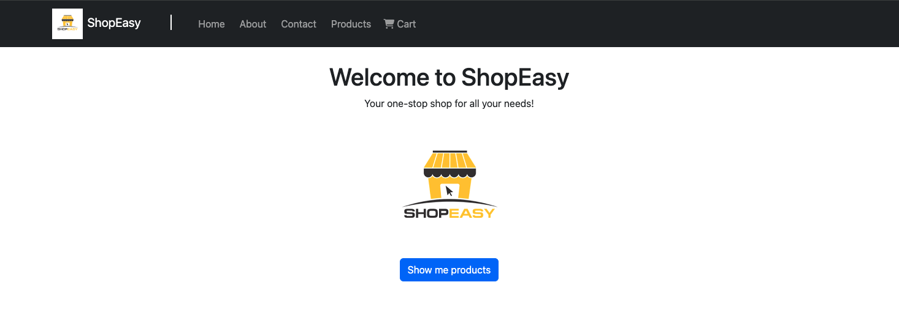
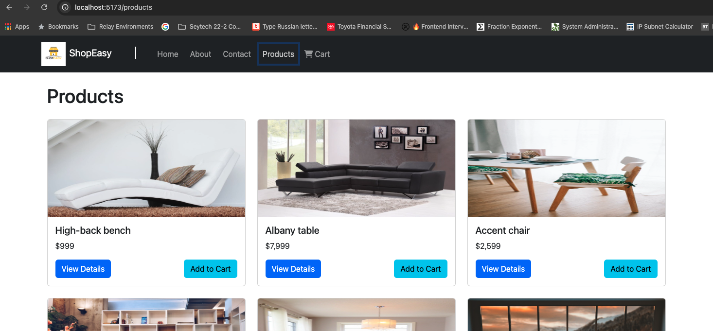
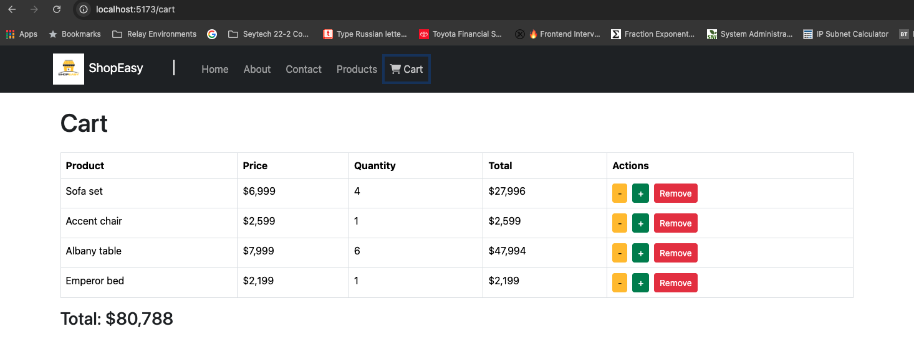

# ShopEasy e-commerce app

### `home` route

### `products` route

### `cart` route

# React + Vite

This template provides a minimal setup to get React working in Vite with HMR and some ESLint rules.

src/
├── components/
│ ├── Navbar.js
│ ├── ProductCard.js
│ ├── ProductList.js
├── pages/
│ ├── Home.js
│ ├── Products.js
│ ├── ProductDetails.js
│ ├── Cart.js
├── App.js
├── index.js
